## Alphabet Soup Applicant Classifier 

Classify Alphabet Soup Grant Application Data using Advanced Machine Learning Models

## Objectives

### Step 1 - Preprocess the Data

* Read in the charity_data.csv to a Pandas DataFrame and identify the target and features.

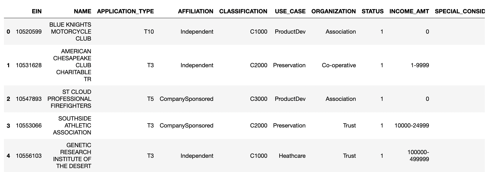

* Drop the EIN and NAME columns

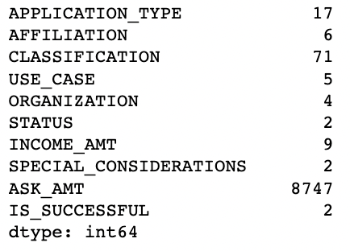

* Determine the number of unique values for each column.
    * For columns that have more than 10 unique values, determine the number of data points for each unique value
    * Use the number of data points for each unique value to pick a cutoff point to bin "rare" categorical variables together in a new value, Other
    
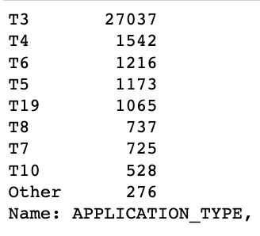                                  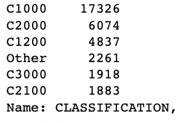

* Use pd.get_dummies() to encode categorical variables

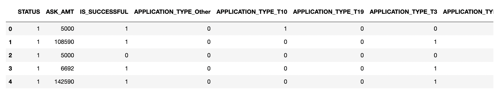

* Split the preprocessed data into a features array, X, and a target array, y. Use these arrays and the train_test_split function to split the data into training and testing datasets

* Scale the training and testing features datasets by creating a StandardScaler instance, fitting it to the training data, then using the transform function

### Step 2 - Compile, Train, and Evaluate the Model

* Create a neural network model by assigning the number of input features and nodes for each layer using TensorFlow and Keras

* Create the first hidden layer and choose an appropriate activation function

* Add a second hidden layer with an appropriate activation function

* Create an output layer with an appropriate activation function

* Check the structure of the model

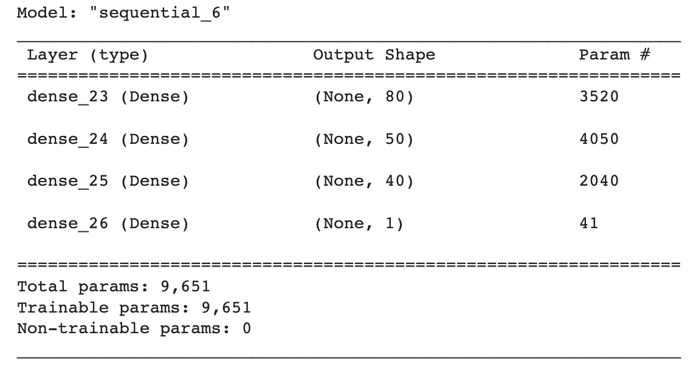

* Compile and train the model

* Evaluate the model using the test data to determine the loss and accuracy

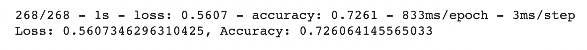

* Save and export results to an HDF5 file

### Step 3 - Optimize the Model

* Optimize your model to achieve a target predictive accuracy higher than 75%

* Model 2 structure

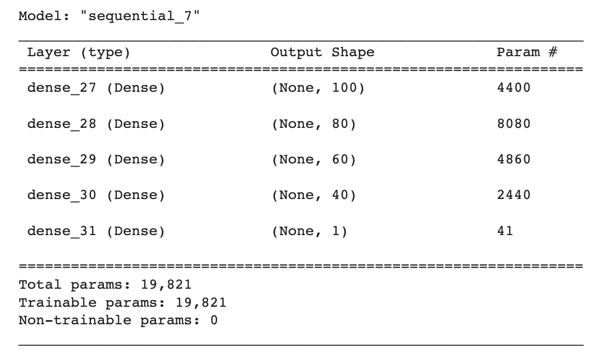

* Model 2 loss and accuracy

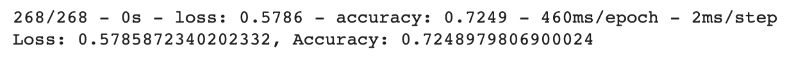

* Model 3 structure

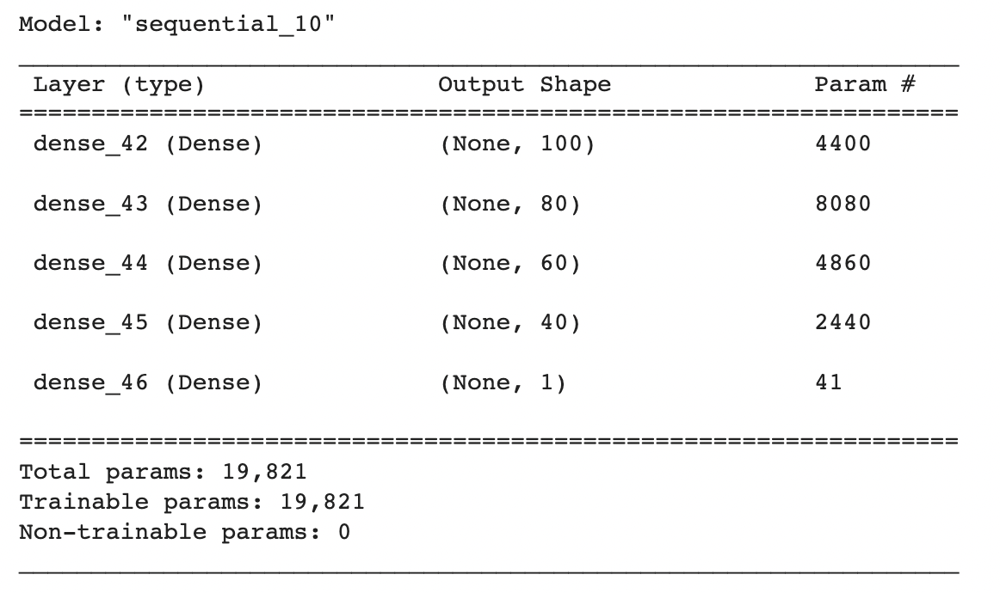

* Model 3 loss and accuracy

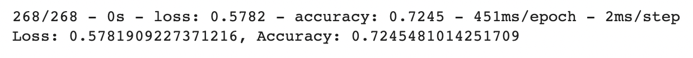

* Model 4 structure

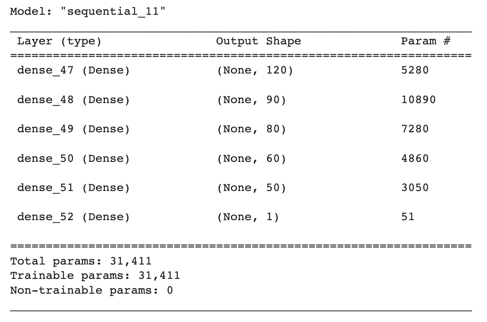

* Model 4 loss and accuracy

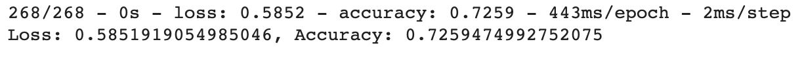

### Step 4 - Write a Report on the Neural Network Model

* Purpose: The purpose of this project is to create a binary classifier that can predict whether applicants will be successful if backed by Alphabet Soup’s funding. This will allow Alphabet Soup to select applicants for funding with the best chance of success in their ventures. 

* Results 
    * Data Preprocessing
        * The target variable for the model is the “IS_SUCCESSFUL” column
        * The features for the model include all the variables included in the data other than “IS_SUCCESSFUL”, and the two columns that were initially dropped in preprocessing, “EIN” and “NAME”. These features include “APPLICATION_TYPE”, “AFFILIATION”, “CLASSIFICATION”, “USE_CASE, ORGANIZATION”, “STATUS”, “INCOME_AMT”, “SPECIAL_CONSIDERATIONS”, “ASK_AMT”
        * The variables that should be removed from the input data are “EIN” and “NAME” because they are indicators of each entry rather than features
    * Compiling, Training, and Evaluating the Model
        * Model Structure
            * The neural network model utilizes three layers because an ideal starting point for NNM’s is 2-4 layers. There are 43 features so 100 neurons, or 2-3 times the amount of input features were used for the first hidden node. The second and third hidden nodes used 60 and 40 neurons respectively. The reLU activation function was utilized because it is ideal for modeling positive, nonlinear input data for classification or regression. The sigmoid function was utilized because its values are normalized to a probability between 0 and 1, which is ideal for a binary classification dataset.
        * Model Accuracy
            * The first model had an accuracy score of 72.7%. After increasing the number of neurons and layers, the second model had an accuracy score of 72.5%. After increasing the epochs, the third model also had an accuracy score of 72.5%. After increasing the number of neurons, layers and epochs again, the fourth model had an accuracy score of 72.6%. These models did not reach the target model performance of 75%.
        * Steps to Increase Model Performance
            * To increase model performance, the model’s neurons, layers and epochs were changed. In the second attempt at modeling, the neurons in each hidden layer were increased and a fourth hidden reLU layer was added. Adding more neurons speeds up the model and may reduce loss. Adding more layers considers more interactions between variables. 
           * In the third attempt at modeling, the epochs were increased from 100 to 200. As the number of epochs increases, so does the amount of information provided to each neuron. Adding more epochs also increases likelihood that model will achieve optimal weight coefficient. 
            * In the fourth attempt, the model’s neurons, layers and epochs were increased. A fifth reLU layher was added and the epochs were increased from 200 to 250. 

* Summary 
    * Model Overview
        * This deep learning model aimed to predict if a company would be classified as successful or no successful based on features of their application. Out of the four models, the highest accuracy score was 72.7% with the lowest loss of 58.5%. These results are not accurate enough for the clients threshold of 75% so more modeling attempts with different hyperparameters would need to be built to create a more reliable binary classifier. 
    * Additional Model Recommendation
        * Another model that could solve this classification problem is the Perceptron or linear binary classifier. The perceptron model mimics a biological neuron by receiving input data, weighting the information, and producing a clear output. It would be a good alternative method for classification because the model separates and classifies the data into two groups using linear equation. For the purpose of this project, those two groups would be successful and not successful. 

---------------------------------------------------

<b>Contact:</b> bronwynmilne64@gmail.com

